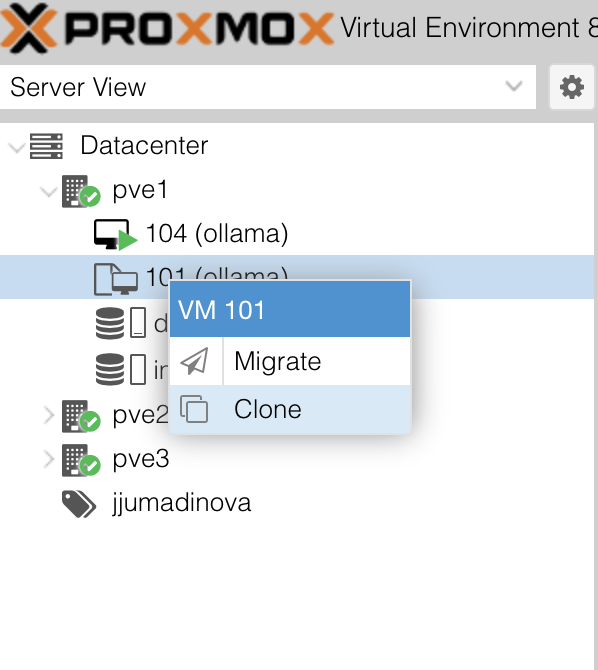

# Project 3: User-centered System

## Timeline

Activity                   | Deadline
-------------------------- | ------------------------------
Regular Commits:  | October 18th-November 8th, 2024 (total: 20 commit requirement, at least 1 on October 25th and November 1st)
Walkthrough | October 25th by 4:20pm
Usability Feedback ([Google Form](https://forms.gle/NiS3ajDudNunhqQQ8)) | November 1st, 2024 during lab
Final submission and Critique | November 8th, 2024 by 11am, critique in class and during lab if needed

## Summary

In this project, you will create a system using models available through the Ollama platform (e.g., `llama3, gemma2, mistral, phi3, qwen2.5, hermes3, dbrx, llava, minicpm-v`). You will design a system to address a specific user group's needs, utilizing prompt engineering techniques such as few-shot learning or chain of thought reasoning to optimize the model's performance. This project emphasizes user-centered design and critical evaluation of the open-source models to optimize functionality.

Additionally, you will conduct an experimentation component, where you evaluate and compare at least three different models. Your final report should document these experiments, analyze model performance, and explain your choice for the best model to use in your system.

**Walkthrough** will require you to explain your initial process to the instructor. Before the walkthrough, you should have:
- identified your user group, user needs and requirements
- decided which model to try first
- made progress in the implementation (have at least a simple prompt working)

**Usability Feedback** will ask everyone to test out each other's systems as users. Before the peer feedback session, you should have:
- experimented with prompting
- a working system on at least one model (does not need to have all of the features) but the way user interacts with the system should be complete

## Learning

* [Methods of Prompt Programming](https://www.promptingguide.ai/techniques)
* [Ollama Models](https://ollama.com/library)
* [Ollama API](https://github.com/ollama/ollama/blob/main/docs/api.md)

## Learning Outcomes

* Practice prompt engineering by applying advanced prompting techniques.
* Design a user-centered system by identifying and addressing specific user needs.
* Experiment with and compare the performance of multiple models to optimize system functionality.
* Evaluate model performance using relevant metrics and report findings in a clear, structured manner.

These assignment learning outcomes contribute to the following course learning outcomes described in the [course syllabus](https://github.com/CMPSC350-Computational-Narrative-F2024/course_information):

1. Correctly describe and apply best practices of prompt engineering across a range of large language model (LLM) platforms to design successful prompts.
3. Demonstrate and criticize systemic bias, ethical issues, and failure modes inherent in language technologies such as LLMs.
4. Develop software to interact with language model application programmer interfaces (APIs).
5. Create and justify a body of text products that leverage text-to-text, text-to-image, and other language model technologies.

This assignment also contributes to the `Modes of Expression` distribution learning outcome.

## Baseline Requirements

* **User-Centered Design**: Clearly identify your system's user group and describe how your system addresses their specific needs. Explain your design decisions based on user requirements.
* **Technical Requirement**: The system must be written in Python and use API calls to interact with models available through the Ollama API.
* **Prompting Techniques**: Employ advanced prompting methods, such as few-shot learning or chain of thought reasoning, to refine system output and address user tasks effectively.
* **Experimentation and Model Evaluation**: Experiment with at least three different models to assess their suitability for your system's tasks. Use relevant metrics (e.g., accuracy, coherence, relevance) to compare model performance, and include any ethical considerations or biases encountered.
* **System Documentation**: Provide a detailed report summarizing your experimentation, findings, and final model choice. Ensure the project includes a README file that outlines the system's functionality, user group,  installation instructions, and use examples.

### User-Centered Design

User-centered design (UCD) focuses on understanding and addressing users' needs, preferences, and challenges to create systems that are intuitive and effective. It emphasizes adapting technology to fit the user, not the other way around. For this project, UCD involves designing a system that solves real problems or enhances tasks for a specific user group using LLMs and prompt engineering. Suggested steps to follow to ensure user-centered design are:

* _Identify the Target User Group_: choose a user group (e.g., instructors, artists) and understand their tasks, challenges, and goals through research or informal interviews.
* _Define User Goals and Requirements_: specify the key tasks your system should assist with and establish requirements that address user needs, prioritizing impactful features.
* _Develop User Scenarios_: create use cases to guide system design, ensuring it aligns with realistic workflows, such as drafting patient summaries for healthcare professionals.
* _Optimize and Improve_: test the system with users, adjust responses with advanced prompt engineering techniques, and improve usability and effectiveness based on feedback.

#### Example Use Cases

* Computer Science Instructor: A tool that assists with creating exam questions, providing code feedback, and/or generating sample programming solutions.
* Artist: A system to help generate creative prompts, brainstorm project ideas, or write artist statements.
* Healthcare Professional: An assistant that drafts patient notes, explains medical terminology, or summarizes patient histories for quick review.
* Content Creator: A system to suggest video titles, draft scripts, or brainstorm ideas for new content.

## Ollama

Ollama is a platform that provides access to various LLMs through a user-friendly API. The department has built a configured system with Ollama template on its virtual machine (VM) cluster that has the following models pre-downloaded: `llama3, gemma2, mistral, phi3, qwen2.5, hermes3, dbrx, llava, minicpm-v`.

You should be able to access ProxMox to manage your virtual machines at any of these:

- [https://pve1.cis.allegheny.edu:8006/](https://pve1.cis.allegheny.edu:8006/)
- [https://pve2.cis.allegheny.edu:8006/](https://pve2.cis.allegheny.edu:8006/)
- [https://pve3.cis.allegheny.edu:8006/](https://pve3.cis.allegheny.edu:8006/)

You can login using your `allegheny.edu` Google account by selecting the `Google OAuth2 Realm`.

There is a template available called `ollama (VM ID 101)` that can be cloned. It has `ollama` already installed with pre-downloaded models (`llama3, gemma2, mistral, phi3, qwen2.5, hermes3, dbrx, llava, minicpm-v`). The username to sign into the template VM will be provided in class; everybody only has permission to work in their own pool.

To clone the template:
- On the left-side tree, expand the `pve1` node. You will see `vm id 101` named `ollama`. Its icon with the paper background indicates that it is a template.
- Right-click it and select `clone`.

- Clone the template, ensuring you add your VM to your own resource pool, otherwise you will encounter a permissions error.

You can use your own terminal emulator by `ssh`-ing into your VM. To do this:
- Find the IP address assigned to your VM. It is listed on the summary page or you can run `ip a` in the console. 
- Then, in your local terminal, `ssh ubuntu@192.168.190.x`, replacing it with your IP address and providing the correct password.

Please see [Ollama's API documentation](https://github.com/ollama/ollama-python) to get started with your Python implementation of your system.

## Assessment

In addition to participation in work-in-progress work described in the [Timeline section](#timeline), your final submission should include three (3) completed and working files for this assignment to be considered "complete". 

### `src/README.md`

This provides an overview of the system, its features and functionality, purpose, installation and use steps and examples.

### `writing/report.md`

This contains documentation of all the prompts you have tried to use along with reflection on their uses. It should also include learning takeaways from this project.

### `src/main.py`

The program behind your system, including communication with the Ollama API. If you use additional programs, include them in `src`.

Final submissions that do not include working code or a (mostly) completed report and README will be considered `Incomplete`. Individuals who do not participate in (most of) the `process` portions of the assignments will have their assignment marked as `Incomplete`.

### GatorGrade

You can check the baseline writing and commit requirements of this project by running department's assignment checking `gatorgrade` tool. To use `gatorgrade`, you first need to make sure you have Python installed. If not, please see:

- [Setting Up Python on Windows](https://realpython.com/lessons/python-windows-setup/)
- [Python 3 Installation and Setup Guide](https://realpython.com/installing-python/)
- [How to Install Python 3 and Set Up a Local Programming Environment on Windows 10](https://www.digitalocean.com/community/tutorials/how-to-install-python-3-and-set-up-a-local-programming-environment-on-windows-10)

Then, you need to install `gatorgrade`:

- First, [install `pipx`](https://pypa.github.io/pipx/installation/)
- Then, install `gatorgrade` with `pipx install gatorgrade`

Finally, you can run `gatorgrade`:

`gatorgrade --config config/gatorgrade.yml`

## Assistance

If you are having trouble completing any part of this project, then please talk with the course instructor or TLs during the laboratory sessions. Alternatively, you may ask questions in the Discord channel for this course. Finally, you can schedule a meeting during the course instructor's office hours.
